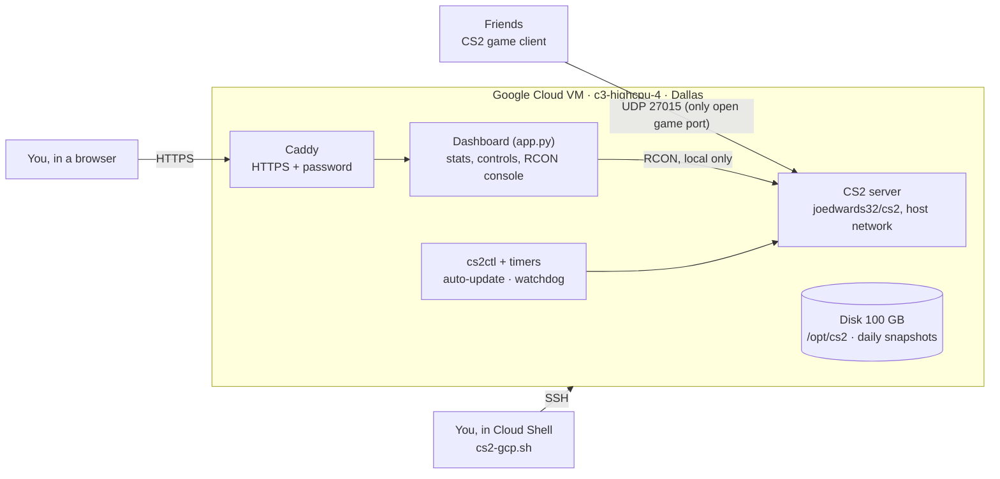
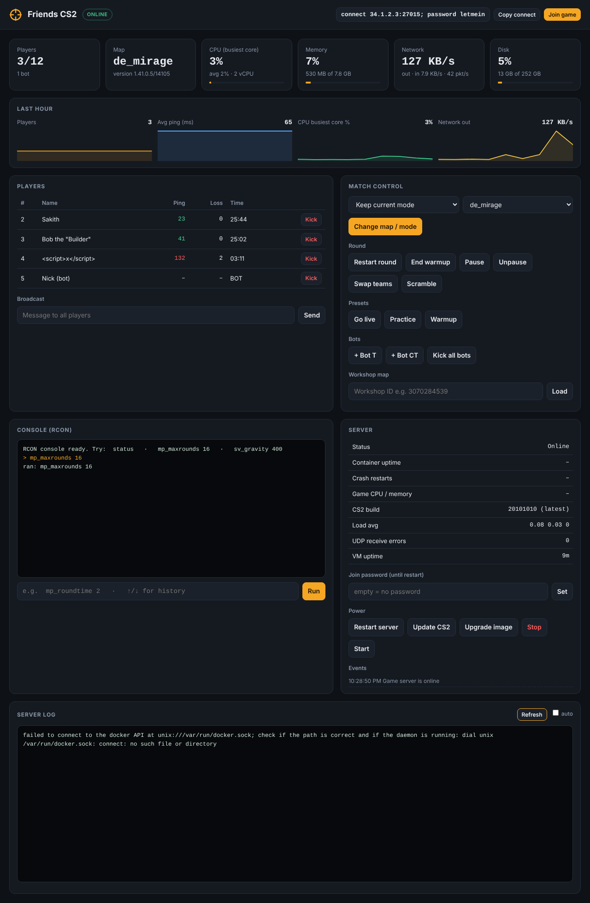

# CS2 Server on Google Cloud — User Guide

As of Oct 3, 2026 · Source: [github.com/sakith-x2code/cs2-gcp-pelican-panel](https://github.com/sakith-x2code/cs2-gcp-pelican-panel) (MIT)

## Overview

One command (`./cs2-gcp.sh deploy`) builds a private Counter-Strike 2 server in Google Cloud's Dallas region, with a password-protected web dashboard for running commands and watching live stats. The same script then handles start/stop, updates, backups and teardown. You can also clone this repo on the VM itself and install or update in place with `vm-install.sh`.

What you get:

- A CS2 dedicated server on a high-clock Google Cloud VM, ~5–10 ms from Houston.
- A web dashboard (HTTPS + login): live players, ping, CPU, memory and network charts; kick, map and mode changes, round controls, presets, an RCON console and the server log.
- Automatic CS2 updates that wait for the server to empty, a crash/hang watchdog, daily disk snapshots.
- Scripts you can re-run safely: every step checks what already exists and only creates or fixes what's missing.



Players only ever touch UDP 27015. The dashboard sits behind Caddy and talks to the game over RCON inside the VM, so RCON is never exposed.

### Open-source components, and why these

| Component | Role | License | Why chosen |
| --- | --- | --- | --- |
| [joedwards32/cs2](https://github.com/joedwards32/CS2) | CS2 dedicated server image | MIT | Most-used CS2 image (535+ stars), actively maintained, updates the game on every restart, documented env-var config |
| Docker + Compose | Runs the game and web front | Apache-2.0 | Clean restarts and upgrades; run with host networking so no NAT sits in the packet path |
| [Caddy](https://caddyserver.com) | HTTPS + password in front of the dashboard | Apache-2.0 | Automatic Let's Encrypt certificates, one small config file |
| cs2 dashboard (this repo) | Web UI + API | MIT | Python standard library only, nothing to install or keep patched |
| Ubuntu 24.04 LTS | OS | Open source | Supported to 2029, unattended security updates |

Alternatives considered: [Pelican Panel](https://github.com/pelican/panel) is a strong open-source panel but is built for hosting many servers (database, Wings daemon, eggs) and adds moving parts for one server. [LinuxGSM](https://linuxgsm.com/servers/cs2server/) works but has had CS2-specific start and monitor bugs. The existing CS2 RCON web panels ([cs2-rcon-panel](https://github.com/shobhit-pathak/cs2-rcon-panel), [rcon-io](https://github.com/fluse/rcon-io)) have seen little maintenance since 2023–24 and show no host stats, so the dashboard here is purpose-built.

## Server specifications

Default build: a **c3-highcpu-4** VM in **us-south1 (Dallas)** with a 100 GB balanced disk on Google's Premium network. Every value below is a setting in `cs2.conf`.

| Item | Default | Why |
| --- | --- | --- |
| Region / zone | us-south1 / us-south1-a (Dallas) | Closest Google region to Houston; [C3 and C4 are offered there, C2D is not](https://cloudprice.net/gcp/regions/us-south1) |
| Machine | c3-highcpu-4: 4 vCPU, 8 GB RAM (Intel Sapphire Rapids) | CS2's server loop is mostly single-threaded, so clock speed matters more than core count; 8 GB holds the server (~2–3 GB) plus update headroom |
| Disk | 100 GB pd-balanced, Ubuntu 24.04 LTS | Game files are ~60 GB; room for updates and workshop maps |
| Network | Premium tier, static external IP, gVNIC | Traffic rides Google's backbone to the edge nearest each player; the IP never changes |
| Swap | 4 GB swap file | Prevents out-of-memory kills during large SteamCMD updates |
| Host maintenance | Live migration, auto-restart on failure | Google moves the VM during maintenance instead of rebooting it |
| Backups | Daily snapshot at 09:00 UTC (4 AM Central), kept 7 days | Roll back a bad update or config in minutes |
| Players | 12 slots (`CS2_MAXPLAYERS`) | 5v5 plus two spectators/subs |

**Sizing.** c3-highcpu-4 is plenty for 10–12 players. For 20+ players, many bots or heavy plugins, use `./cs2-gcp.sh resize c3-highcpu-8`. For a newer CPU, `c4-highcpu-4` also works in Dallas but needs `DISK_TYPE="hyperdisk-balanced"`. If your friends are spread across the US, `us-central1` (Iowa) is the fairest middle point.

### Approximate cost

Compute is billed only while the VM runs, so stopping it between sessions is the biggest saving. [c3-highcpu-4 lists at about $0.17/hour in Iowa](https://calculator.holori.com/gcp/vm/c3-highcpu-4); Dallas runs a little higher. Disk (~$10/month for 100 GB balanced) and the reserved IP are billed even while stopped.

| Usage | Compute | Disk + IP + snapshots | Est. total / month |
| --- | --- | --- | --- |
| ~4 h a night, VM stopped otherwise (~120 h) | ~$22 | ~$17 | **~$40** |
| Weekends only (~40 h) | ~$8 | ~$17 | **~$25** |
| Always on (730 h) | ~$130 | ~$17 | **~$150** |

Estimates exclude network egress, which is small for a 10-player server (a few GB per month). Confirm in the [Google Cloud pricing calculator](https://cloud.google.com/products/calculator) and set a budget alert in Billing.

## Before you start

You need three things: a Google Cloud project with billing, a Steam Game Server Login Token, and a terminal with `gcloud` (Google Cloud Shell has it built in).

- [ ] **Google Cloud project with billing.** In the [Cloud Console](https://console.cloud.google.com), create a project (e.g. `cs2-friends`) and link a billing account. Note the project ID.
- [ ] **Steam Game Server Login Token (GSLT).** Sign in at [steamcommunity.com/dev/managegameservers](https://steamcommunity.com/dev/managegameservers), enter App ID **730**, a memo like `gcp-cs2`, and create. The Steam account must not be limited and needs a phone number attached. Without a token, players outside the server's network may be unable to join.
- [ ] **Terminal.** Easiest: open **Cloud Shell** (the `>_` icon top-right in the Cloud Console). It already has `git`, `gcloud`, `bash` and your login. On your own Mac/Linux/WSL machine, install the [Google Cloud CLI](https://cloud.google.com/sdk/docs/install) and run `gcloud auth login`.
- [ ] **Quota.** New projects allow 8+ vCPUs per region by default, enough for c3-highcpu-4. `./cs2-gcp.sh preflight` shows your free quota.
- [ ] **(Optional) Your home IP.** Search "what is my IP" and keep it for locking the dashboard to your network (see Security).
- [ ] **(Optional) A domain.** If you own one, point an A record such as `cs2.example.com` at the server IP after deploy and set `DASH_DOMAIN`. Otherwise the dashboard gets a free `<ip>.sslip.io` address.

## Installation

Pick one path: **A** does everything from Cloud Shell in one command; **B** creates the cloud resources, then you pull the repo on the VM and install there. Both take about 5 minutes of commands, then 10–25 minutes while the VM downloads ~60 GB of game files.

### Path A — everything from Cloud Shell

1. **Clone the repo** in Cloud Shell:
   ```bash
   git clone https://github.com/sakith-x2code/cs2-gcp-pelican-panel.git cs2-gcp
   cd cs2-gcp
   ```
2. **Create your config.** Answer the prompts (project ID, GSLT token, server name, join password, region). This writes `cs2.conf` (private, git-ignored); open it with `nano cs2.conf` to review every commented setting.
   ```bash
   ./cs2-gcp.sh init
   ```
3. **Check everything** — login, project, APIs, quota and machine availability in your zone. If the machine isn't offered, it lists zones that have it.
   ```bash
   ./cs2-gcp.sh preflight
   ```
4. **Deploy.** Enables the Compute API, creates the `cs2-net` network, firewall rules, static IP, VM and snapshot schedule, then uploads and runs the installer (Docker, OS tuning, swap, CS2 container, Caddy, dashboard, update and watchdog timers). Passwords are generated and saved into `cs2.conf`.
   ```bash
   ./cs2-gcp.sh deploy
   ```
5. **Get your details** — connect string, `steam://` link, dashboard URL and login:
   ```bash
   ./cs2-gcp.sh info
   ```

### Path B — pull and run on the VM

1. **Create the cloud resources** from Cloud Shell (same `init` as path A, then `infra` instead of `deploy`), and open a shell on the VM:
   ```bash
   git clone https://github.com/sakith-x2code/cs2-gcp-pelican-panel.git cs2-gcp
   cd cs2-gcp && ./cs2-gcp.sh init && ./cs2-gcp.sh infra
   ./cs2-gcp.sh ssh
   ```
2. **On the VM, clone and install.** `vm-install.sh` asks for the Steam token, server name, join password and admin IP on first run, saves them to `~/cs2/cs2.conf`, installs everything, and prints the connect string and dashboard login.
   ```bash
   sudo apt-get install -y git
   git clone https://github.com/sakith-x2code/cs2-gcp-pelican-panel.git cs2
   cd cs2 && sudo ./vm-install.sh
   ```

Using a VM you made yourself? It needs Ubuntu 22.04/24.04 or Debian 12 on x86_64 (4 vCPU, 8 GB, 100 GB disk) and firewall rules allowing **UDP 27015** from everyone and **TCP 80, 443** from your admin IP. Then run step 2.

### After either path

Open the dashboard and turn on **Server log → auto**, or run `sudo cs2ctl logs -f` on the VM. The status goes *updating* → *starting* → **online**. After the first download, restarts take 1–2 minutes.

Keep a private copy of `cs2.conf`: it holds your passwords and Steam token and is never committed to git. Re-running `deploy`, `infra` or `vm-install.sh` is safe at any time; each repairs what is missing and leaves the rest alone.

## Connecting and playing

Friends join with the server IP on port 27015 and the join password, if you set one.

- **From the game console:** enable the console (Settings → Game → *Enable Developer Console*), press `~`, then type `connect <IP>:27015; password <yourpassword>`.
- **One click:** share the `steam://connect/<IP>:27015/<password>` link from `./cs2-gcp.sh info` or the dashboard's **Join game** button. Opening it in a browser launches CS2 and joins.
- **Spectating:** set `TV_ENABLE=1` and run `./cs2-gcp.sh deploy` (opens the firewall) to enable CSTV on UDP 27020 (`connect <IP>:27020`).

Game mode, start map and bots are set in `cs2.conf` (`CS2_GAMEALIAS`, `CS2_STARTMAP`, `CS2_BOT_QUOTA`) and can be changed live from the dashboard.

**Saving money between sessions:** `./cs2-gcp.sh stop` after playing and `./cs2-gcp.sh start` before. The IP stays the same, so friends keep the same connect string; the game is ready about 2 minutes after start.

## Using the dashboard

Open the URL from `./cs2-gcp.sh info` (`https://<ip-with-dashes>.sslip.io`) and sign in with `DASH_USER` / `DASH_PASSWORD`. If the certificate isn't ready yet, use `https://<IP>` and accept the self-signed warning. It refreshes every 5 seconds and works on phones.



| Area | What it shows or does |
| --- | --- |
| Header | Server name, status (online / starting / updating / stopped), connect string with **Copy** and **Join game** |
| Stat tiles | Players, current map and version, CPU of the busiest core, memory, network throughput, disk |
| Last hour | Charts of players, average ping, busiest-core CPU and outbound traffic |
| Players | Name, ping (green < 70 ms, amber, red > 120 ms), packet loss, time on server, **Kick**; broadcast chat |
| Match control | Change map, optionally with a new mode (competitive, casual, wingman, deathmatch, arms race); restart round, end warmup, pause/unpause, swap or scramble teams; bots; load a Workshop map by ID |
| Presets | **Go live** (standard competitive values, restart in 3 s), **Practice** (cheats, infinite money and ammo, grenade preview), **Warmup** |
| Console | Any server command over RCON, with ↑/↓ history |
| Server | Status, container uptime, crash restarts, game CPU/memory, CS2 build vs latest, load, UDP receive errors, VM uptime; set a temporary join password; restart, update, upgrade, stop, start; event log |
| Server log | Last 400 lines of the game log, optional auto-refresh |

Why *busiest core* instead of average CPU: CS2's simulation runs mainly on one thread, so one core pinned near 100% causes lag even when the average looks low. Sustained values above ~85% mean it is time to `resize` to a bigger machine.

A yellow banner appears when Valve ships a CS2 update. It installs on its own once the server is empty, or immediately with **Update now**.

## Day-to-day management

Run these from the `cs2-gcp` folder in Cloud Shell. Commands that touch the game need the VM running.

| Command | What it does |
| --- | --- |
| `./cs2-gcp.sh info` | Connect string, dashboard URL and login |
| `./cs2-gcp.sh status` | VM state, players, map, installed vs latest CS2 build |
| `./cs2-gcp.sh start` / `stop` | Start or stop the VM (stopped = no compute charge) |
| `./cs2-gcp.sh restart` | Restart the game server (also installs a pending update) |
| `./cs2-gcp.sh update` | Install a CS2 update now, with a 60-second in-game warning if players are on |
| `./cs2-gcp.sh upgrade` | Pull the newest server image and recreate the container |
| `./cs2-gcp.sh rcon "changelevel de_mirage"` | Run any console command |
| `./cs2-gcp.sh logs 300` | Last 300 lines of the server log |
| `./cs2-gcp.sh ssh` | Shell on the VM; then `sudo cs2ctl help` for on-box commands (`status`, `say`, `console`, `logs -f`) |
| `./cs2-gcp.sh snapshot` | On-demand backup of the disk |
| `./cs2-gcp.sh resize c3-highcpu-8` | Change machine size (about 1 minute of downtime) |
| `./cs2-gcp.sh destroy` | Delete everything except existing snapshots (asks you to type the VM name) |

### Changing settings

1. Edit `cs2.conf` (e.g. server name, max players, start map, join password, bots).
2. Run `./cs2-gcp.sh push`. It re-uploads the config and scripts and recreates the game container only if its settings changed.

Firewall and network settings (`ADMIN_CIDR`, `TV_ENABLE`) take effect with `./cs2-gcp.sh deploy`.

Avoid the characters `' " $` and backticks in names and passwords; a `/` in the server name is handled automatically.

### Updating the scripts and dashboard

Pull the latest code and re-apply; your `cs2.conf` is git-ignored and survives the pull. Game updates from Valve are separate and install automatically.

| Installed with | Update command |
| --- | --- |
| Path A (Cloud Shell) | `cd ~/cs2-gcp && git pull && ./cs2-gcp.sh push` |
| Path B (on the VM) | `cd ~/cs2 && git pull && sudo ./vm-install.sh` |

With path B, change settings by editing `~/cs2/cs2.conf` on the VM and re-running `sudo ./vm-install.sh`.

### Server configs and mods

Game files live on the VM in `/opt/cs2/data`. To override competitive defaults, create `/opt/cs2/data/game/csgo/cfg/gamemode_competitive_server.cfg` (e.g. `mp_maxrounds 24`) and restart. Metamod/CounterStrikeSharp can be enabled through the image's `pre.sh` hook in the same folder; see the [image README](https://github.com/joedwards32/CS2).

## Performance, connectivity and reliability

Each item below is applied automatically by the installer; none needs manual setup.

| Goal | What the build does |
| --- | --- |
| Low, steady ping | Dallas region; Premium network tier (Google backbone to the player's nearest edge); static IP |
| No packet-path overhead | Game container uses host networking (no Docker NAT); gVNIC network adapter |
| Fewer dropped packets | Larger UDP socket buffers and backlog (`/etc/sysctl.d/90-cs2.conf`); dashboard tracks UDP receive errors |
| Smooth server tick | High-clock C3 CPU; server hibernation disabled; dashboard watches the busiest core |
| No memory crashes | 4 GB swap, low swappiness; 8 GB RAM |
| Survives crashes | Docker restarts the container on exit (`unless-stopped`); systemd brings the stack up at boot |
| Survives hangs | Watchdog checks RCON every 2 minutes; after 3 failures (~6 min) it restarts the server, skipping boot and update windows |
| Always current | Auto-update checks Steam every 10 minutes; installs when the server is empty, or after 90 minutes with an in-game warning |
| Survives Google maintenance | Live migration plus automatic restart on host failure |
| Recoverable | Daily snapshots kept 7 days; manual `snapshot` any time |
| Safe OS patching | Unattended security updates, never an automatic reboot mid-match |
| Bounded logs | Docker log rotation (5 × 20 MB) so the disk never fills with logs |

To tune further: `CS2_SERVER_HIBERNATE` stays 0 (the image notes hibernation can crash the server); raise `UPDATE_FORCE_AFTER_MIN` if long matches get interrupted; set `AUTO_UPDATE=0` to update only by hand.

## Security

Only the game port is open to the internet; RCON is never exposed, and admin access is limited to SSH keys and a password-protected HTTPS dashboard.

| Port | Open to | Purpose |
| --- | --- | --- |
| UDP 27015 | Everyone | Game traffic |
| UDP 27020 | Everyone, only if `TV_ENABLE=1` | CSTV |
| TCP 22, 80, 443 | `ADMIN_CIDR` (default: everyone) | SSH (keys via gcloud), dashboard HTTPS, certificate validation |
| TCP 22 | Google IAP range 35.235.240.0/20 | SSH through Google's tunnel |
| TCP 27015 (RCON) | Nobody | Reached only from inside the VM by the dashboard |

Recommended hardening:

- [ ] Set `ADMIN_CIDR="<your home IP>/32"` and run `./cs2-gcp.sh deploy`. SSH then goes through Google's IAP tunnel automatically, and the dashboard switches to a self-signed certificate (Let's Encrypt can't reach a locked-down server). Your browser shows a one-time warning to accept.
- [ ] Keep the generated passwords (20+ random characters). Change one by clearing it in `cs2.conf` and running `./cs2-gcp.sh push` (or `sudo ./vm-install.sh` on the VM).
- [ ] Don't share `cs2.conf`; it holds the RCON, dashboard and Steam token secrets. It is git-ignored — never force-add it.
- [ ] Set a join password (`CS2_PW`) so strangers can't fill the server.

The dashboard rejects cross-site requests (custom header plus origin check), validates every map, ID and message, and runs behind Caddy's HTTPS and login. Anyone with the dashboard password can run any server command, so treat it like the RCON password.

## Troubleshooting

Start with `./cs2-gcp.sh status` (or `sudo cs2ctl status` on the VM) and the dashboard's **Server log**; most problems show up in one of them.

| Symptom | Likely cause | Fix |
| --- | --- | --- |
| `preflight`: "Can't use project …" / "not found or no access" | Running `cs2-gcp.sh` on the VM (its service account can't manage Compute Engine), a project name/number instead of the ID, or a different gcloud account | On the VM use `sudo ./vm-install.sh` instead; otherwise run from Cloud Shell, check `gcloud config list` and `gcloud projects list`, and put the exact project ID in `cs2.conf` |
| `preflight`: machine type not offered in zone | C3 capacity differs by zone | Use a zone it lists, or `MACHINE_TYPE="c4-highcpu-4"` with `DISK_TYPE="hyperdisk-balanced"` |
| `deploy` fails on quota | Region CPU or IP quota too low | IAM & Admin → Quotas → request more "CPUs" for the region |
| Status stuck on *updating* for 30+ min | Large first download | Normal on first run; check progress with `./cs2-gcp.sh logs` |
| Status stuck on *starting* | Server crashed during boot | Check the log; `./cs2-gcp.sh restart`; if game files are damaged, set `STEAMAPPVALIDATE=1` in `cs2.conf` and push; once online, set it back to 0 and push |
| Friends get "server not responding" | Missing or invalid GSLT token, or firewall | Check `SRCDS_TOKEN` (App ID 730, not expired), then `./cs2-gcp.sh push`; confirm firewall rule `cs2-server-game` exists |
| Game version mismatch on join | Valve just shipped an update | Dashboard → **Update now**, or `./cs2-gcp.sh update` |
| Dashboard certificate error | Let's Encrypt still issuing, or `ADMIN_CIDR` restricted | Use `https://<IP>` and accept the warning; with your own domain set `DASH_DOMAIN` and `push` |
| Dashboard says "RCON authentication failed" | Password changed outside the script | Run `./cs2-gcp.sh push` (or `sudo ./vm-install.sh`) to resync |
| Lag spikes | Busiest core above ~85%, or UDP receive errors climbing | `./cs2-gcp.sh resize c3-highcpu-8`; check players' own connections (loss column) |
| `ssh` times out after locking `ADMIN_CIDR` | IAP not allowed for your account | Grant yourself the *IAP-secured Tunnel User* role, or set `SSH_VIA_IAP=0` and include your IP |
| `git pull` on the VM refuses (local changes) | A tracked file was edited on the VM | Keep edits in `cs2.conf` only; `git stash` then pull |
| Something broke after a change | Bad config or update | Compute Engine → Snapshots → create a disk from yesterday's snapshot, or `./cs2-gcp.sh destroy` and `deploy` again |

On the VM, `journalctl -t cs2ctl` shows every automatic update and watchdog restart.
